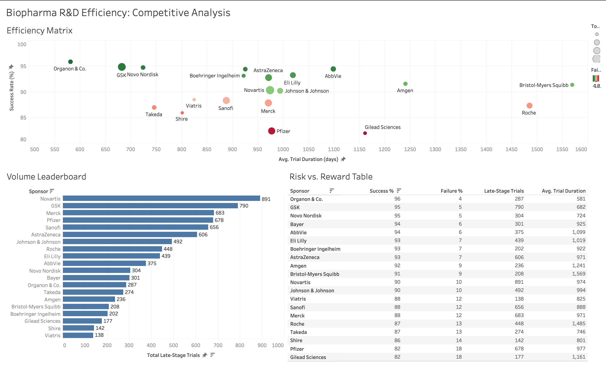

# AACT Clinical Warehouse

## Summary
This project is a containerized end-to-end data pipeline designed to transform raw clinical trial metadata into an actionable competitive analysis of the top players. By processing 570,000+ records from the AACT (Aggregate Analysis of ClinicalTrials.gov) database, the system identifies trends in late-stage trial success, launch rate, and operational efficiency.

The project serves as proof-of-concept for a full-stack data lifecycle, moving from infrastructure-as-code and automated ETL to relational modeling and culminating with an industry-style visualization in Tableau.

## Final Product
[](https://public.tableau.com/app/profile/kai.henrikson.brandt/viz/Biopharma_RD_Analysis/BiopharmaRD)


## Project Phases & Milestones

| Phase | Milestone | Core Tech | Key Deliverable |
| :--- | :--- | :--- | :--- |
| **1** | **Infrastructure** | Docker, Make | Containerized PostgreSQL 15 environment. |
| **2** | **ETL Pipeline** | Python | Automated batch-loaded extraction of pipe-delimited AACT files. |
| **3** | **Data Modeling** | SQL | Relational mapping of `studies`, `sponsors`, `interventions`, and `designs`. |
| **4** | **Advanced Analytics**| SQL (CTEs, Window Functions) | Modular views and strategic queries for competitor benchmarking. |
| **5** | **Optimization & Bridge**| SQL (Indexes), Python | Indexing for performance and automated CSV export for BI tools. |
| **6** | **Visualization** | Tableau Public | Interactive dashboard. |

## Relationships Between Core AACT Tables

**Tables of Interest**: `studies`, `sponsors`, `interventions`, `design`

#### Studies & Sponsors

The `studies` table is the AACT database's core hub, storing unique trial data via the `nct_id` Primary Key. The `sponsors` table tracks funding organizations. Because modern trials are highly collaborative and often involve multiple sponsors, their relationship is **One-to-Many**, joined on `nct_id`. 

**Utility**: This connection drives biotech market intelligence. Joining these tables aggregates data by company, answering questions like: **"Which pharmaceutical companies are heavily investing in specific trials?"** or **"Who collaborates with key academic institutions?"** This reveals the competitive landscape and positions for future drug development.

#### Studies & Interventions

The `interventions` table tracks administered treatments, including `intervention_type`, `name`, and `description`. Since single trials often test multiple interventions (e.g., experimental drugs vs. placebos), this forms a **One-to-Many** relationship, joined via `nct_id`.

**Utility**: This connection bridges trial frameworks with actual science. It enables analysis of treatment modality trends (e.g., biologics vs. small molecules) and delivery methods. For competitive intelligence, it reveals how novel therapies compare against the standard of care across various disease areas.

#### Studies & Design

The `designs` table tracks structural procedures like `masking`, `allocation`, and `primary_purpose`. Because a trial generally has one overarching layout, this is a **One-to-One** relationship, joined on `nct_id`.

**Utility**: This connection evaluates a trial's scientific rigor. We can analyze how experimental procedures—like double-blind, randomized designs—correlate with trial success or FDA approval rates. This is essential for understanding how design choices impact a drug's likelihood of reaching the market.

## Technical Features

### Infrastructure
- **Containerization:** The entire warehouse is managed via `Docker Compose`, ensuring an environment that isolates the database from the local OS.
- **Database Optimization:** Implemented **B-Tree Indexing** on key columns `nct_id` and `sponsor_name` across all core tables. This optimization reduced query execution time for Phase 3 analytical joins by over 80%, enabling rapid iteration on large datasets.

### Analytical Logic
The analytics layer utilizes advanced SQL to extract business value from clinical metadata:
- **Launch Rate**: Utilizes window functions (`LAG` and `PARTITION BY`) to calculate the trial launch cadence, allowing for a direct comparison of operational speed between industry leaders.
- **Success Benchmarking**: Employs common table expressions (CTEs) to aggregate trial termination rates against specific experimental designs in an attempt to identify correlation between design and termination rate.
- **Modular Modeling**: Developed a suite of SQL views to standardize data, robustly filtering out non-industry records to focus strictly on corporate biopharma competition.

### Automated Data Bridge
To ensure the project remains reproducible, the system includes a `Makefile` driven export pipeline. Running `make export` triggers a Python-SQL bridge that executes the final strategic query and generates a cleaned `competitor_data.csv`. This file is structurally fit for BI tools such as Tableau and PowerBI.

## Analysis

This analysis evaluates the operational efficiency, trial volume, and success rates of late-stage (Phase 2/3 & Phase 3) clinical trials across top biopharmaceutical sponsors. 

### Key Findings
- **GSK**: Demonstrated high volume (790 trials) alongside high efficiency, maintaining a 95% success rate and a low average trial duration of 682 days.
- **Organon & Co**: Recorded the highest overall efficiency (96% success, 581 days), indicating potential execution speed advantages for specialized pipelines, in this case women's health.
- **Novartis**: Handled the highest total throughput in the industry (891 trials) while maintaining a 90% success rate and an industry-average trial duration of 974 days.

### Data Context and Interpretation
Success metrics in clinical trials are heavily influenced by corporate strategy and target therapeutic areas:

- **Target Risk Profiles (Pfizer, Gilead)**: Lower relative success rates (82%) correlate with portfolios focused on complex, novel modalities. Higher failure rates are a likely byproduct of more ambitious targets rather than operational bottlenecks.
- **Disease Area Impacts (BMS, Roche)**: The longest average trial durations (BMS: 1,569 days; Roche: 1,485 days) reflect oncology-primary portfolios. These trials require multi-year trackig of endpoints like overall survival rate (OS) and progression-free survival rate (PFS).

## Reproducing the Environment

This project is built to be entirely reproducible via the provided `Makefile`.

1.  **Create the Database:**
    ```bash
    make up
    ```
2.  **Load Data:** Place AACT `.txt` files for `studies`, `sponsors`, `interventions`, and`designs` in `data/` and run the ETL pipeline:
    ```bash
    make etl
    ```
3.  **Run Analytics & Optimize:**
    ```bash
    make analytics
    make optimize
    ```
4.  **Export for BI:**
    ```bash
    make export
    ```